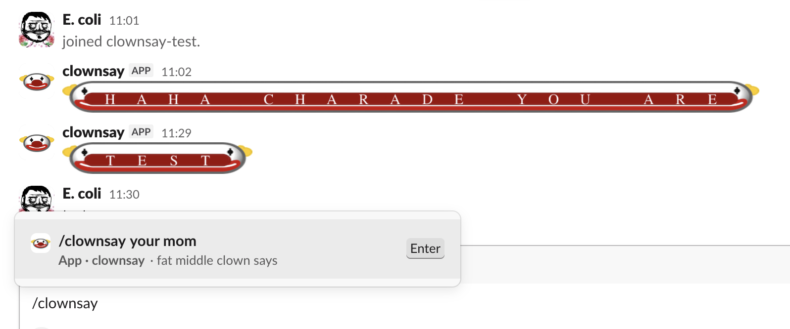

# clownsay

A Slack `/clownsay` slash command. Turns text into a clown-bookended emoji banner.



Behind the scenes it just outputs a bunch of :slacmojis: (see emoji pack below):

```
/clownsay hey there
→ :fat_left_clown::mch::mce::mcy::middle_clown::mct::mch::mce::mcr::mce::fat_right_clown:
```

A single banner wraps the whole phrase. Letters become `:mc<letter>:` emojis (lowercase a–z), non-letters are dropped, and `:middle_clown:` separates words.

## Stack

A single-file Cloudflare Worker at `src/index.js`. No framework, no build step. One Worker serves multiple Slack workspaces — each workspace has its own Slack app, and the Worker accepts requests signed by any configured signing secret.

## Initial deploy

Prerequisites: Node.js, and a Cloudflare account.

1. **Set up Cloudflare.** Sign up at https://dash.cloudflare.com/sign-up (the free plan covers this Worker comfortably). On first deploy you'll be prompted to register a `*.workers.dev` subdomain — pick anything; the Worker's URL will be `fatmiddleclownsay-slack.<your-subdomain>.workers.dev`. Optionally edit `name` in `wrangler.jsonc` if you want a different Worker name. Then authorize wrangler against your account:
   ```bash
   npx wrangler login    # opens a browser
   ```
2. **Create a Slack app.** Go to https://api.slack.com/apps → **Create New App** → **From scratch**. Pick the workspace you want it installed in.
3. **Copy the Signing Secret** from the app's **Basic Information** page (under *App Credentials*).
4. **Deploy the Worker** with that secret:
   ```bash
   npx wrangler secret put SLACK_SIGNING_SECRET    # paste the Signing Secret
   npx wrangler deploy
   ```
   `wrangler deploy` prints the Worker URL — copy it.
5. **Add the slash command.** In the Slack app, go to **Slash Commands** → **Create New Command**:
   - Command: `/clownsay`
   - Request URL: the Worker URL from step 4
   - Short description: anything (e.g. *Clown-bookend some text*)
6. **Add bot scopes.** Go to **OAuth & Permissions** → **Scopes** → **Bot Token Scopes** and add `commands`.
7. **Install the app** to the workspace from **Install App** (or **OAuth & Permissions** → **Install to Workspace**).
8. **Upload the emoji pack** (see below).
9. Try `/clownsay hello` in any channel.

## Adding another workspace

One Worker can serve many workspaces — each gets its own Slack app and signing secret.

1. Create a new Slack app at https://api.slack.com/apps (**From scratch**, pick the new workspace).
2. Add a `/clownsay` slash command pointing at the **same Worker URL** as the first install.
3. Add the `commands` bot scope.
4. Copy the new app's Signing Secret and register it under a new env var name:
   ```bash
   npx wrangler secret put SLACK_SIGNING_SECRET_2
   npx wrangler deploy
   ```
   Any suffix works — the Worker auto-discovers any env var starting with `SLACK_SIGNING_SECRET`.
5. Install the app to the new workspace.
6. Upload the emoji pack (see below).

## Required emoji pack

Each workspace needs these custom emoji uploaded:

- `:fat_left_clown:` — left bookend
- `:fat_right_clown:` — right bookend
- `:middle_clown:` — separator between words
- `:mca:` through `:mcz:` — one per letter

The image files are in `emoji_pack/`. Without them, output renders as literal `:mca:` text instead of images.

Slack has no bulk-upload API on Free/Pro/Business+ plans, so use a Chrome extension to upload the pack:

- [Neutral Face Emoji Tools](https://chromewebstore.google.com/detail/neutral-face-emoji-tools/anchoacphlfbdomdlomnbbfhcmcdmjej)
- [Slack Custom Emoji Manager](https://chromewebstore.google.com/detail/slack-custom-emoji-manage/cgipifjpcbhdppbjjphmgkmmgbeaggpc)

## Iterating

```bash
# Edit src/index.js, then:
npx wrangler deploy

# Stream live logs:
npx wrangler tail
```

Deploys take a few seconds and go global immediately.
